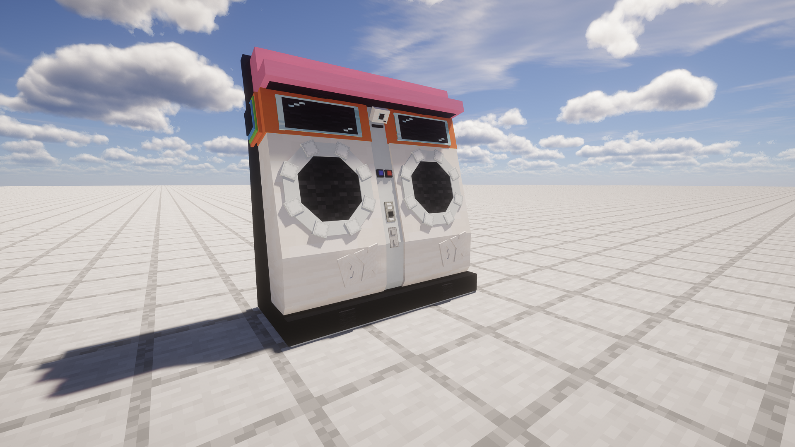

# Minecraft maimaiDX Display Entity Model

---

几乎 1:1 的 **舞萌DX** 机台模型，
 只使用[**展示实体**](https://zh.minecraft.wiki/w/%E5%B1%95%E7%A4%BA%E5%AE%9E%E4%BD%93)在**我的世界**中制作。

An almost 1:1 model of **maimaiDx** machine,
 built in **Minecraft**,
 use only [**display entities**](https://minecraft.wiki/w/Display).

>   整个模型包含 _113 个实体_，命令长度超过了原版命令方块的限制，
>    因此建议配合模组 [**Axiom**](https://modrinth.com/mod/axiom) 使用。
>
>   使用 **Axiom** 后，只需要复制完整命令，然后在世界中按下粘贴快捷键(默认为`Ctrl`+`V`)，**Axiom**会自动识别并放置在世界上。
>

>   This "model" include 113 entities, full command is over vanilla command block length limit.
>    Suggest using [**Axiom**](https://modrinth.com/mod/axiom) mod.
>
>   With **Axiom**, all you need to do is copy full command, and press your 'paste' hot key (`Ctrl`+`V` by default),
>    **Axiom** will recognise it and place it on world.
>

[_Commands_](model/model.command.md)
